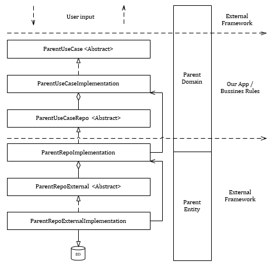

# clean_core (for dart/flutter)

`clean_core` (for dart/flutter) pretende ser un framework para estructurar y organizar el código de una aplicación siguiendo **UNA VARIANTE** de [Clean Architecture](https://blog.cleancoder.com/uncle-bob/2012/08/13/the-clean-architecture.html) presentada por [Robert C. Martin (Uncle Bob)](https://en.wikipedia.org/wiki/Robert_C._Martin), explicada en su libro [Clean Architecture](https://sites.google.com/eq.greatbooklibrary.com/budalngaret35/pdfbook-download-clean-architecture-by-robert-c-martin).
Esta implementación de la arquitectura que se presenta **NO** sigue al pie de la letra sus estándares, es sino una abstracción adaptada a las comodidades propias de sus desarrolladores.

## Table of Contents
  - [Table of Contents](#table-of-contents)
  - [Vista general de la arquitectura](#Vista-general-de-la-arquitectura)
    - [Leyenda](#leyenda-#1)
  - [Implementació Basica de la arquitectura](#implementació-basica-de-la-arquitectura)
    - [Leyenda](#leyenda-#2)
  - Posteriormente (No implementados en la primera versión):
    - Modulos
    - Servicios
    - Domain validation / Resources

## Vista general de la arquitectura
A continuación un diagrama con la vista general de la arquitectura, mostrando las principales capas con flujo de entrada descendente y de respuesta ascendente.

### Leyenda #1:
- `User input`: Entrada del usuario, puede ser por seleccionar una acción en la UI, como cargar una lista con cierta información.
- `Domain`: El Domain va a ser la unidad básica que traslada información, por lo tanto, luego de que el usuario selecciona cargar la lista, este espera una Lista de Domains. Esta capa tiene las validaciones por cada campo del Domain y la lógica básica de formateo de campos (como parseo de fechas y demás).
- `Use Case`: Dicha llamada la va a procesar el Caso de Uso, este necesita la información y se la solicita al repositorio, y una vez el repositorio se la entrega la procesa, ordenándola, uniendola con otros pedazos de información, etc ..., y posteriormente devolviendo esta lista de Domain al usuario. Esta capa también es la encargada de validaciones entre multiples Domain y similares.
- `Repository`: El Caso de Uso llama a la capa de repositorio para obtener la información. Aqui hay una bifurcación entre capas, dado que se necesita acceder a un repositorio externo, con características que no controlamos nosotros ya que está desarrollado por terceros. Como consecuencia, el repositorio se define en la capa interna, con nuestras necesidades, y se implementa en la capa externa, adaptándose a las características del framework específico. Esta capa es la encargada de solicitar la información a dicha entidad externa, recibir su respuesta, y convertirla al Domain que espera el Caso de Uso. Esta capa también es la encargada de cifrar la información o traducirla y similares, en caso de ser necesario.
- `Entity`: Equivalente al Dominio pero para la información de los frameworks externos. Se considera externa ya que puede ser generada por un tercero, o seguir ciertos estándares de otros. En resumen lleva un `import` de un framework externo.
- `Repository External`: Herramienta de un tercero encargado directamente de la 'persistencia'(intercambio) de la información.

## Implementació basica de la arquitectura
A continuación el diagrama al estilo UML con una implementación de ejemplo.

### Leyenda #2:
- `ParentUseCase`: Clase abstracta (interfaz) para **definir** los métodos de la lógica.
- `ParentDomain`: Unidad atómica de Parent.
- `ParentUseCaseImplementation`: **Implementación** de lo que se definió en `ParentUseCase`. Esta implementación tiene una dependencia directa al repositorio, ya que a este se le van a hacer las llamadas para obtener la información. **PERO** la dependencia es solo a la definición del repositorio, que forma parte de la capa interna, en runtime se le inyecta al Caso de Uso en el constructor dicha implementación, para lograr la inversión de control, y no hacer el caso de uso dependiente de la implementacion del repositorio.
- `ParentRepo`: Clase abstracta (interfaz) para **definir** los métodos de acceso al repositorio. Interna ya que la definimos en dependencia de lo que necesitemos en nuestro Use Case y la implementamos con el framework externo.
- `ParentRepoImplementation`: **Implementación** de lo que se definió en `ParentRepo`. También tiene como en el Caso de Uso la dependencia del Repo externo, pero solo su definición, la implementación se inyecta igual que en el caso del Caso 
- `ParentRepoExternal`: Clase abstracta (interfaz) para **definir** los métodos necesarios propios del framework externos de repositorio.
- `ParentRepoExternalImplementation`: **Implementación** de lo que se definió en `ParentRepoExternal`.

### Detalles de implementación
Los detalles de implementación se pueden encontrar en el [ejemplo](https://github.com/JesusHdezWaterloo/clean-core-flutter/tree/develop/example)

## Posteriormente (No implementados en la primera versión)
### Modules

### Application Service
#### Authentication

#### Exception

#### Notification

#### User Resolver

### Domain
#### Resource Service
#### Validations